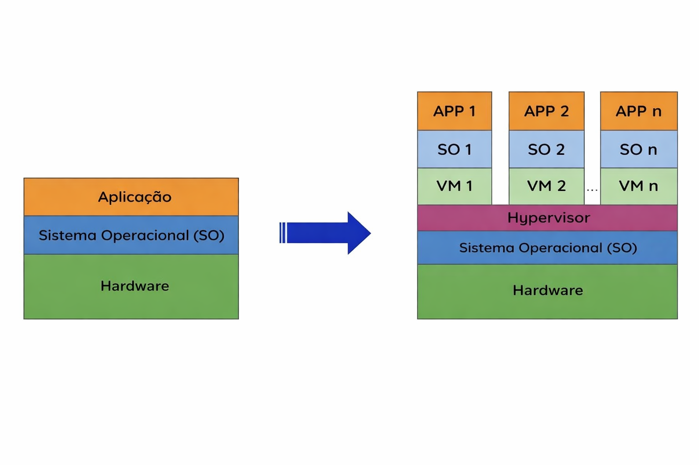

# Docker - Infraestrutura

## Como funcionava antigamente?

Anteriormente, a infraestrutura era baseada em **servidores físicos dedicados**, onde cada serviço rodava em uma máquina específica com seu próprio sistema operacional.

Exemplo:
- 1 servidor → PostgreSQL + Windows  
- 1 servidor → Aplicação + Linux  

#### Problemas desse modelo

- Alto custo com **energia elétrica, refrigeração e cabiamento**
- Elevado custo de **manutenção de hardware**
- **Baixa utilização de recursos** (muito tempo ocioso)
- Escalabilidade difícil e pouco flexível

#### Consequência

Mesmo com poucos serviços, era necessário manter vários servidores, o que gerava **alto custo e desperdício de recursos**.

---

## Virtualização

Para resolver esses problemas, surgiu a **virtualização**, o que permitiu executar múltiplos sistemas operacionais em uma única máquina física.

Nesse modelo, um software chamado **Hypervisor** gerencia as máquinas virtuais (VMs).

### Tipos de Hypervisor

- **Tipo 1 (Bare Metal)**  
  Executa diretamente no hardware, sem um sistema operacional intermediário.  
  → Maior desempenho e eficiência

- **Tipo 2 (Hospedado)**  
  Executa como um software dentro de um sistema operacional.  
  → Mais simples, porém com mais overhead

#### Vantagens da Virtualização

- Melhor aproveitamento dos recursos de hardware  
- Redução do tempo ocioso  
- Diminuição de custos com infraestrutura física  
- Maior flexibilidade na criação e gerenciamento de ambientes  

#### Desvantagens da Virtualização

Apesar dos benefícios, ainda existem limitações importantes:

- Cada VM possui um **sistema operacional completo**, consumindo recursos próprios  
- O consumo de recursos cresce proporcionalmente ao número de VMs  

##### Exemplo de consumo:

Se um sistema operacional consome:
- 1 GB de RAM  
- 10 GB de disco  
- 10% de CPU  

Com 4 VMs, teremos aproximadamente:
- 4 GB de RAM  
- 40 GB de disco  
- 40% de CPU  

##### Outros problemas

- Alto custo de **manutenção** (atualizações, segurança, configuração)
- Maior complexidade de gerenciamento

LINK DA PLAYLIST: https://www.youtube.com/playlist?list=PLViOsriojeLrdw5VByn96gphHFxqH3O_N