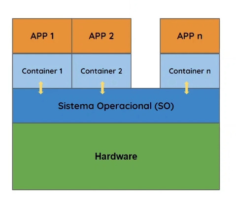

# Containers

## O que são? 

Containers são uma forma de **empacotar uma aplicação junto com todas as suas dependências** (bibliotecas, configurações, runtime), garantindo que ela funcione de maneira consistente em qualquer ambiente.
Diferente das máquinas virtuais, os containers **não possuem um sistema operacional próprio completo**. Em vez disso, eles compartilham o kernel do sistema operacional hospedeiro, o que os torna muito mais leves e eficientes.
Em outras palavras, um container é um **ambiente isolado de execução**, mas que utiliza os recursos do sistema de forma muito mais direta.

- São muito mais leves.
- Nascem/morrem rápido.
- Sem custos de manutenção do SO. 

No modelo de containers, não existe mais a necessidade de um sistema operacional para cada aplicação (como nas VMs).  
No lugar disso, surge uma camada chamada **Container Runtime** (como o Docker), responsável por:

- Gerenciar os containers
- Isolar processos
- Controlar uso de recursos
- Permitir a comunicação com o sistema operacional hospedeiro

Essa abordagem reduz significativamente o consumo de recursos, pois elimina a sobrecarga de múltiplos sistemas operacionais.

## Por que usar containers?

Sem containers, aplicações costumam gerar problemas como:

- Conflito de versões de bibliotecas  
- Dificuldade de replicar ambientes  
- Necessidade de reiniciar servidores inteiros em caso de falha  

Com containers, isso muda bastante.

Se uma aplicação apresenta problema, é possível simplesmente **parar (ou matar) o container**, sem impactar o restante do sistema. Além disso, cada container pode ter sua própria versão de dependências, o que elimina conflitos.

### Vantagens dos Containers

- Melhor uso dos recursos de hardware  
- Isolamento entre aplicações  
- Facilidade de escalabilidade  
- Ambientes reproduzíveis (dev → teste → produção)  
- Deploy rápido e automatizado  
- Possibilidade de rodar múltiplas versões de bibliotecas  
- Muito mais leves que máquinas virtuais  
- Não requer manutenção de múltiplos sistemas operacionais  

Além disso, containers permitem limitar e controlar o uso de recursos, como:

- CPU  
- Memória  
- Disco  

Isso evita que uma aplicação consuma todos os recursos do sistema.

---