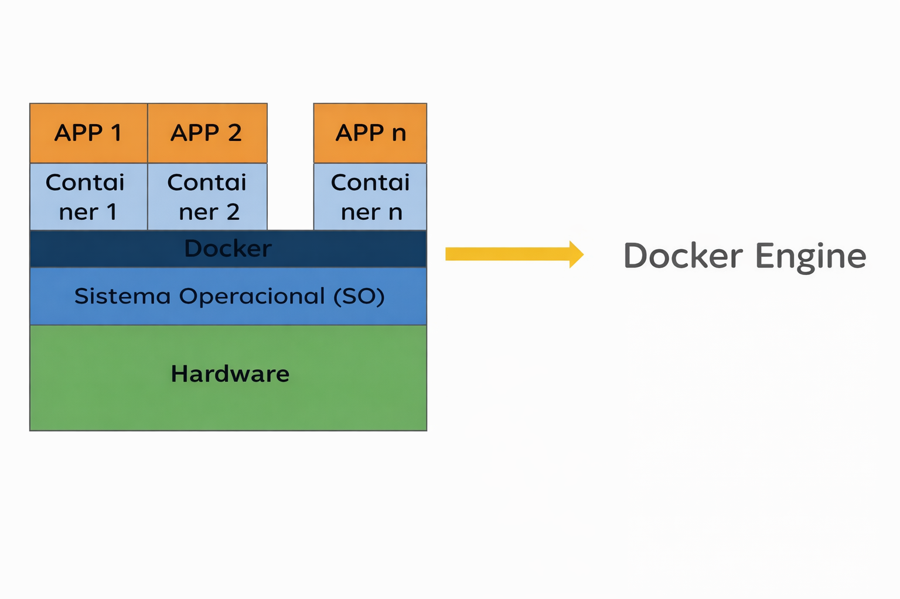
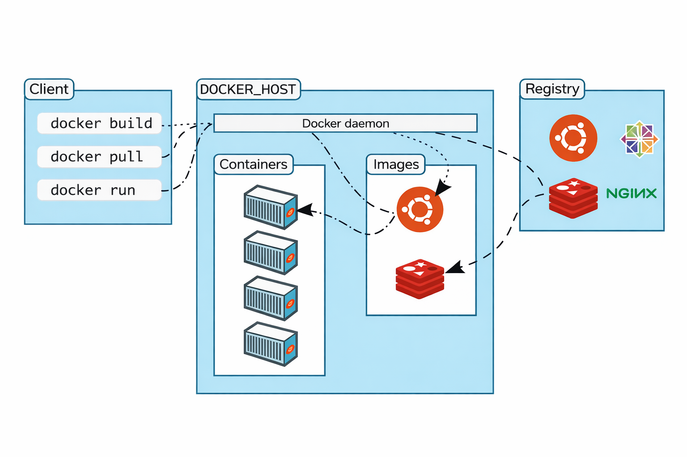

# Docker

## O que é o Docker?

##### Da Wikipédia:

O Docker é um conjunto de produtos de plataforma como serviço que usam a virtualização em nível de sistema operacional para fornecer software em pacotes chamados containers.

Basicamente, é uma maneira de virtualizar um novo sistema operacional limpo. Em vez de usar uma Máquina Virtual (VM), você pode usar o Docker para implantar aplicativos.
Diferente de uma máquina virtual, o Docker **não cria um novo sistema operacional completo**.  

O Docker é uma ferramenta de código aberto (open source).

## Como o Docker funciona na prática?

O Docker trabalha com o conceito de **imagens** e **containers**:

- **Imagem (Image)** → É um "molde" imutável da aplicação (código + dependências)
- **Container** → É a execução dessa imagem (uma instância em funcionamento)
Ou seja:
> Imagem = projeto  
> Container = aplicação rodando 

### Mas afinal, como é a arquitetura do docker? 

O Client é responsável por receber os comandos, os quais são enviados para o Docker Daemon, que interpreta esses comandos e executa as ações necessárias. 

- Docker Client
É a interface utilizada pelo usuário (linha de comando ou API).

- Docker Daemon (dockerd)
É o principal componente do Docker, responsável por executar e gerenciar todas as operações.
Responsável por:
    - Criar, iniciar e parar containers
    - Gerenciar imagens
    - Controlar redes e volumes
    - Executar comandos recebidos do Docker Client

- Docker Registry
É o repositório onde as imagens Docker são armazenadas.
Pode ser:
    - Público (ex: Docker Hub)
    - Privado (repositórios internos)